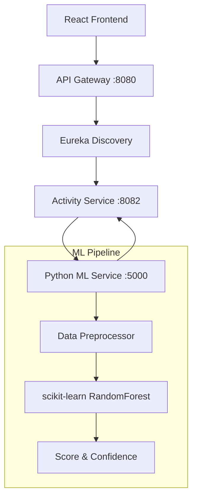

# ML Architecture

## Overview
The EduTrack system utilizes a dedicated Python microservice (`ml-service`) to execute true Machine Learning predictions for student appraisal scores and personalized recommendations, replacing previous rule-based heuristics.

## Microservice Architecture

## Dataset & Training Strategy
Due to the absence of historical institutional labelled data, a **Synthetic Dataset Pipeline** will be constructed.
- **`train.py`**: Generates synthetic records representing verified student activities across multiple domains (Technical, Arts, Sports, Research).
- **Features**: `verified_count`, `category_diversity`, `certifications`, `competitions`, `workshops`.
- **Target**: `appraisal_score` (0-100).

## Algorithm Selection
- **Algorithm:** `RandomForestRegressor` via `scikit-learn`.
- **Rationale:** High explainability, robust against non-linear interactions between diverse activity categories, and highly resistant to overfitting on synthetic distributions.

## Fallback Mechanism
If the `ml-service` fails (e.g., timeout, network partition), `activity-service` acts as a Circuit Breaker, routing the request to `AiService.java`, which provides a mathematical heuristic score explicitly tagged as `fallback_mode=true` to the frontend.
